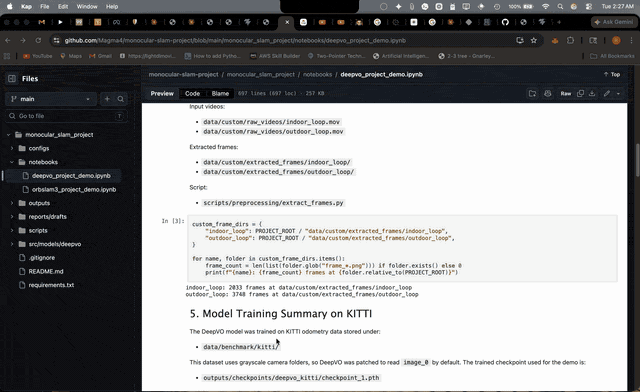
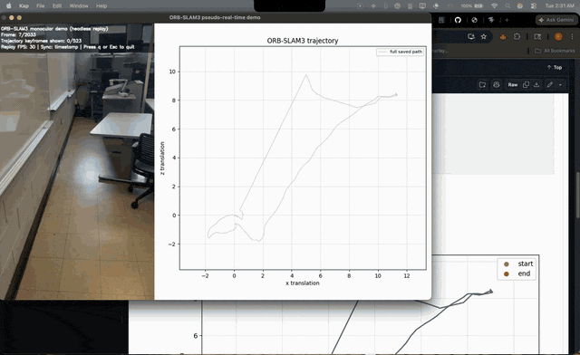

# Monocular SLAM / Visual Odometry Semester Project

This repository contains a semester project on monocular visual odometry and monocular SLAM-style localization. The project compares a learning-based visual odometry method, DeepVO, with a classical feature-based monocular SLAM baseline, ORB-SLAM3, on KITTI benchmark data and custom video sequences.

The repository is organized around reproducible preprocessing, inference, trajectory plotting, report drafts, notebooks, and pseudo-real-time replay demos.

## Objectives

- Study monocular camera motion estimation using visual odometry and SLAM.
- Train and evaluate DeepVO on KITTI odometry data.
- Run DeepVO inference on custom monocular videos.
- Run ORB-SLAM3 in monocular headless mode on the same custom frame sequences.
- Compare drift, tracking robustness, setup complexity, and macOS deployment issues.
- Create report-ready trajectory plots, markdown summaries, notebooks, and replay demos.

## Current Implementation Status

Completed:

- DeepVO is set up under `src/models/deepvo/`.
- DeepVO was patched for MacBook M4 / Apple Silicon by removing hardcoded CUDA assumptions and using MPS or CPU fallback.
- KITTI grayscale odometry data was used through `image_0`.
- DeepVO training completed and produced `checkpoint_1.pth` locally.
- DeepVO benchmark inference was run on KITTI sequences `04` and `06`.
- Custom videos were converted into extracted frame sequences.
- DeepVO trained-checkpoint inference was run on `indoor_loop`, `outdoor_loop`, and `outdoor_loop2`.
- ORB-SLAM3 was built locally on macOS and run as a monocular baseline.
- ORB-SLAM3 was run headless because the Pangolin viewer crashed on macOS main-thread GUI handling.
- ORB-SLAM3 produced TUM-format trajectories for `indoor_loop`, `outdoor_loop`, and `outdoor_loop2`.
- Pseudo-real-time replay demos exist for both DeepVO and ORB-SLAM3.
- Report summaries, comparison notes, notebooks, and plots are included for portfolio/report use.

Important note: ORB-SLAM3 is implemented and used for comparison, but the full ORB-SLAM3 source/build tree, vocabulary, and binaries are excluded from GitHub because they are large local build artifacts.

## Real-Time-Style Demos

These demos are pseudo-real-time visualizations. They replay already-extracted frames and reveal saved trajectory outputs over time. They are not live model inference or live SLAM tracking.

### DeepVO Replay Demo



Run the default indoor DeepVO replay:

```bash
.venv/bin/python scripts/visualization/deepvo_realtime_demo.py
```

Run the new `outdoor_loop2` DeepVO replay:

```bash
.venv/bin/python scripts/visualization/deepvo_realtime_demo.py \
  --frames data/custom/extracted_frames/outdoor_loop2 \
  --trajectory outputs/trajectories/deepvo/custom_trained/outdoor_loop2/predicted_trajectory.csv \
  --fps 24
```

### ORB-SLAM3 Replay Demo



Run the default indoor ORB-SLAM3 replay with smoother presentation timing:

```bash
.venv/bin/python scripts/visualization/orbslam3_realtime_demo.py --sync-mode even
```

Run the new `outdoor_loop2` ORB-SLAM3 replay:

```bash
.venv/bin/python scripts/visualization/orbslam3_realtime_demo.py \
  --frames data/custom/extracted_frames/outdoor_loop2 \
  --trajectory outputs/trajectories/orb_slam3/outdoor_loop2/keyframe_trajectory_tum.txt \
  --fps 24 \
  --sync-mode even
```

## Folder Structure

```text
monocular_slam_project/
├── assets/
│   └── demo_gifs/              # Optimized README demo GIFs
├── configs/                    # Project-level settings files
├── data/                       # Local datasets/videos/frames, excluded from GitHub
├── notebooks/                  # Report/demo notebooks
├── outputs/
│   ├── checkpoints/            # Local checkpoints, excluded from GitHub
│   ├── logs/                   # Local run logs, excluded from GitHub
│   ├── plots/                  # Small report-ready trajectory plots
│   └── trajectories/           # Small report-ready trajectory outputs
├── reports/
│   └── drafts/                 # Markdown summaries and final report draft
├── scripts/
│   ├── preprocessing/          # Frame extraction and dataset checks
│   ├── inference/              # DeepVO and ORB-SLAM3 runner scripts
│   └── visualization/          # Plotting and pseudo-real-time demos
└── src/
    └── models/
        └── deepvo/             # Patched DeepVO code
```

## Setup

Create and activate the project virtual environment:

```bash
cd monocular_slam_project
python3 -m venv .venv
source .venv/bin/activate
python -m pip install --upgrade pip
python -m pip install -r requirements.txt
```

For Apple Silicon, enable PyTorch fallback for unsupported MPS operations:

```bash
export PYTORCH_ENABLE_MPS_FALLBACK=1
```

## DeepVO Workflow

Extract custom frames:

```bash
.venv/bin/python scripts/preprocessing/extract_frames.py \
  data/custom/raw_videos/indoor_loop.mov \
  data/custom/extracted_frames/indoor_loop
```

For large portrait video such as `outdoor_loop2`, resize during extraction to keep local storage practical:

```bash
.venv/bin/python scripts/preprocessing/extract_frames.py \
  data/custom/raw_videos/outdoor_loop2.MOV \
  data/custom/extracted_frames/outdoor_loop2 \
  --max-width 1280
```

Validate KITTI layout:

```bash
.venv/bin/python scripts/preprocessing/check_kitti_layout.py
```

Run DeepVO custom inference with the trained checkpoint:

```bash
PYTORCH_ENABLE_MPS_FALLBACK=1 .venv/bin/python scripts/inference/run_deepvo_custom.py \
  --frames data/custom/extracted_frames/indoor_loop \
  --output outputs/trajectories/deepvo/custom_trained/indoor_loop \
  --checkpoint outputs/checkpoints/deepvo_kitti/checkpoint_1.pth
```

Plot a DeepVO trajectory:

```bash
.venv/bin/python scripts/visualization/plot_trajectory.py \
  outputs/trajectories/deepvo/custom_trained/indoor_loop/predicted_trajectory.csv \
  outputs/plots/deepvo/custom_trained/deepvo_custom_trained_indoor_loop_trajectory.png
```

## ORB-SLAM3 Workflow

ORB-SLAM3 was built locally under `src/models/orb_slam3/`, but that local build tree is excluded from GitHub. The project keeps the wrapper scripts and settings needed to explain and reproduce the workflow.

Run ORB-SLAM3 headless on a custom sequence:

```bash
.venv/bin/python scripts/inference/run_orbslam3_kitti_custom.py \
  --sequence indoor_loop \
  --fps 30 \
  --no-viewer
```

Run ORB-SLAM3 on `outdoor_loop2` using the portrait settings file:

```bash
.venv/bin/python scripts/inference/run_orbslam3_kitti_custom.py \
  --sequence outdoor_loop2 \
  --fps 24 \
  --settings configs/orbslam3_custom_outdoor_loop2_1280x2276.yaml \
  --no-viewer
```

Plot an ORB-SLAM3 trajectory:

```bash
.venv/bin/python scripts/visualization/plot_orbslam3_trajectory.py \
  outputs/trajectories/orb_slam3/outdoor_loop2/keyframe_trajectory_tum.txt \
  --output outputs/plots/orb_slam3/outdoor_loop2_trajectory.png \
  --title outdoor_loop2
```

## Outputs and Results

DeepVO outputs:

```text
outputs/trajectories/deepvo/custom_random/
outputs/trajectories/deepvo/custom_trained/
outputs/trajectories/deepvo/kitti_benchmark/
outputs/plots/deepvo/
```

ORB-SLAM3 outputs:

```text
outputs/trajectories/orb_slam3/
outputs/plots/orb_slam3/
```

Key report-ready files:

```text
reports/drafts/deepvo_summary.md
reports/drafts/orbslam3_summary.md
reports/drafts/comparison_summary.md
reports/drafts/final_project_report.md
notebooks/deepvo_project_demo.ipynb
notebooks/orbslam3_project_demo.ipynb
```

## Excluded from GitHub

Large or machine-specific files are intentionally excluded:

- KITTI benchmark dataset files
- Raw custom videos
- Extracted frame folders
- Model checkpoints such as `.pth` files
- Python virtual environments
- Python cache files
- Jupyter checkpoint files
- ORB-SLAM3 local source/build tree, vocabulary, Pangolin build, and binaries
- Run logs and temporary generated adapter inputs
- Large root-level raw GIF/video exports

This keeps the repository small, readable, and suitable for GitHub portfolio use.

## Notes and Limitations

- DeepVO is visual odometry, not full SLAM. It accumulates relative motion and can drift over time.
- ORB-SLAM3 is a full SLAM system, but this project uses monocular mode, so trajectory scale is arbitrary without external scale information.
- The custom ORB-SLAM3 settings use approximate camera intrinsics, not full camera calibration.
- `outdoor_loop2` is a large portrait video. ORB-SLAM3 produced a valid trajectory but showed many tracking failures and map resets, making it a useful robustness case rather than a clean result.

## Next Steps

- Improve custom camera calibration for ORB-SLAM3.
- Add quantitative trajectory metrics where ground truth is available.
- Export the final markdown/notebook content into a polished PDF report.
